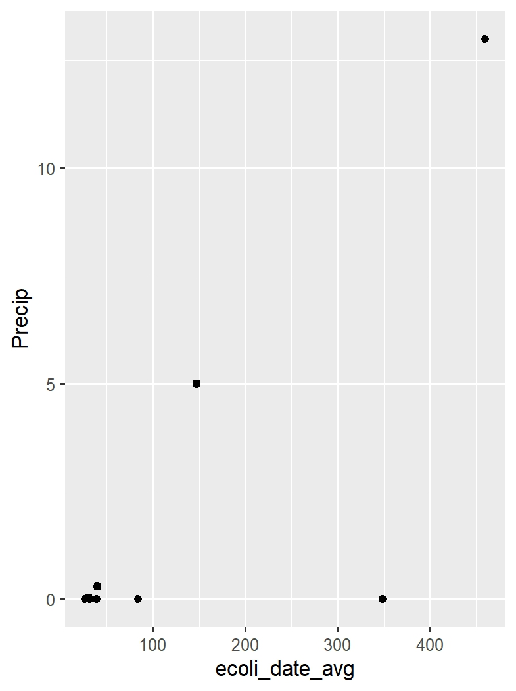

```{r setup, include=FALSE}
library(kableExtra)
library(knitr)
knitr::opts_chunk$set(echo = TRUE)
```

### Background  

In the summer of 2023 I had the opportunity to be a part of the Utah Lake Project. This project included various UVU professors and students, assembled into teams, setting out to study various aspects of Utah Lake. 
I was privileged to be a part of the microbiology team with Dr. Lauren Brooks!  
&nbsp;  
  
&nbsp;  

My lab partner and I spend the summer sampling water from sites around Utah Lake. We used these samples to test for E. coli using what is called a Quanti-tray Analysis.  
&nbsp;  
  
&nbsp;  
&nbsp; 

### I am going to use the E. coli data I collected to ask two questions:  
&nbsp;  

**- 1. Does a site's average distance to farmland affect E. coli levels measured there?**  
*(Why does this matter?: E. coli bacteria is abundantly found in fecal matter- a byproduct of livestock! Peek this image of us working on public relations with the culprit in question)*  
&nbsp;  
  
&nbsp;  
**- 2. Does precipitation level affect average E. coli levels on any given day?**  
*(Why does this matter?: Precipitation can affect the amount of runoff into the lake, bringing bacteria with it! Peek this image of last summer's flooding during our project)*  
&nbsp;  
  
&nbsp;  
&nbsp;  

Before we get much further, here is a look at the sample data I collected
&nbsp;  
&nbsp;  

```{r, results = 'asis', echo = FALSE}
Edat <- read.csv("E.Coli_count_summary.csv")
kable(Edat, "html", escape = FALSE) %>% 
  kable_styling(full_width = FALSE) %>% 
  scroll_box(height = "300px", width = "100%", fixed_thead = TRUE)  
````  

&nbsp;  
&nbsp;  
Here's what it looks like in dot plot form
&nbsp;  
  

&nbsp;  
&nbsp;  


  
&nbsp;  
&nbsp;  

I like including this next plot because it showcases using Lubridate. It also shows that we visited the North and South sites on different days!
&nbsp;  
&nbsp;  

  
&nbsp;  
&nbsp;  
&nbsp;  

### Question Number 1
#### Does a site's average distance to farmland affect E. coli levels measured there?  
&nbsp;  
&nbsp;  
First, let's look at the table I created for the 5 closest farms to each of 7 sites  
&nbsp;  
  
```{r, results = 'asis', echo = FALSE}
Fdist <- read.csv("Farms_near_sites.csv")
kable(Fdist, "html", escape = FALSE) %>% 
  kable_styling(full_width = FALSE) %>% 
  scroll_box(height = "300px", width = "100%", fixed_thead = TRUE)  
````  
&nbsp;  
&nbsp;  
And a figure too

  


Using cor.test, I tried to see if there was a correlation between E. coli levels and distance to farmland  
&nbsp;  

`cor.test(merged$avg_dist_to_farm, merged$avg_ecoli_count)`  
&nbsp;
&nbsp;  
#### Result... 0.07 ... No correlation!
I was really hoping there would be!  
&nbsp;  
&nbsp;  

#### Discussion on Question 1
Thinking about farmland distribution and how waste from farmland makes it into water systems, there are just so many factors involved. Each farm likely has different drainage and irrigation systems. Some are near rivers that feed into the lake, some aren't. Some use flood irrigation, some don't. I think if I could somehow account for all of these other factors, or measure the output for each farm instead of just distance, that data would show a correlation.  
&nbsp;  
&nbsp;  
&nbsp;  

### Question Number 2
#### Does precipitation level affect average E. coli levels on any given day?  
&nbsp;  
&nbsp;  
Here is a table of the precipitation data for the duration of the project  
&nbsp;  
&nbsp;  

```{r, results = 'asis', echo = FALSE}
Pdat <- read.csv("Precip_data.csv")
kable(Pdat, "html", escape = FALSE) %>% 
  kable_styling(full_width = FALSE) %>% 
  scroll_box(height = "300px", width = "100%", fixed_thead = TRUE)  
````  
&nbsp;  
&nbsp;  
Now plotting against average E. coli levels per date
&nbsp;  
&nbsp;  

&nbsp;  
&nbsp;  

Another correlation test  
&nbsp;  
`cor.test(precip_merge$ecoli_date_avg, precip_merge$Precip)`  
&nbsp;  

#### Result... 0.75... Strong correlation!!!  
&nbsp;  
&nbsp;  

#### Discussion on Question 2  

I am really happy to see a correlation here! I remember seeing all the crazy flooding and being convinced that our E. coli levels would go up.  
However, my sample size was quite small and over a pretty short time period. I think if my data set had been larger I would have gotten a more convincing correlation here.  
&nbsp;  
&nbsp;  
&nbsp;  
### Conclusion
The biggest take-away for me was honestly: I wish I had more data!!! This project really made me want to keep studying Utah Lake so I could find some really solid correlations. I really enjoyed being able to use my own data for this final project and learn so many things about R.